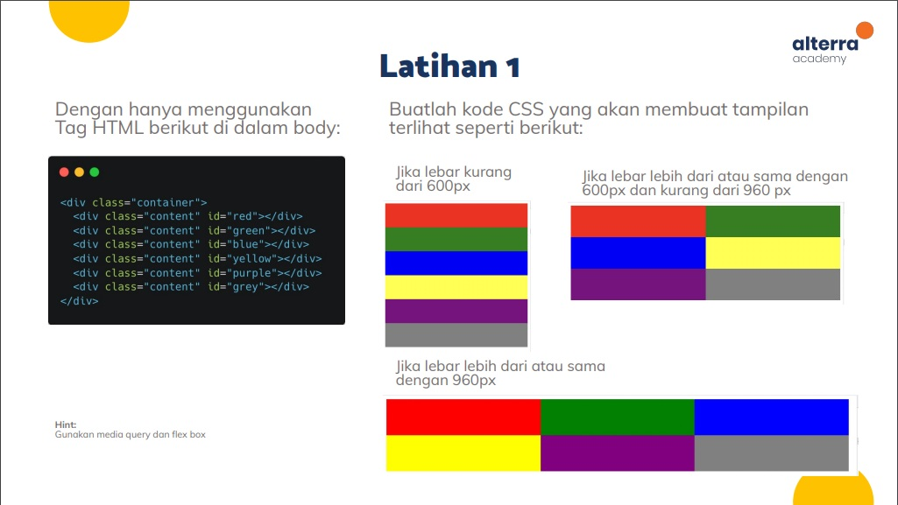

# Dasar-Dasar HTML dan CSS
Repositori ini memuat jawaban dari tugas membuat tampilan web yang responsif menggunakan CSS flexbox dan media query dalam kursus Vue Js kartu prakerja.

## Tugas 1

## Tugas 2

